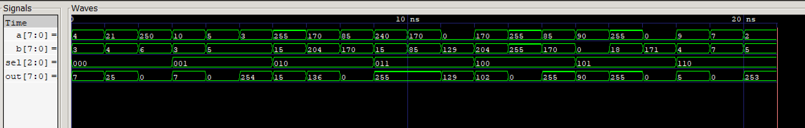
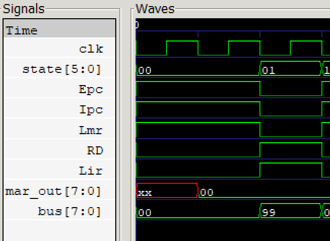
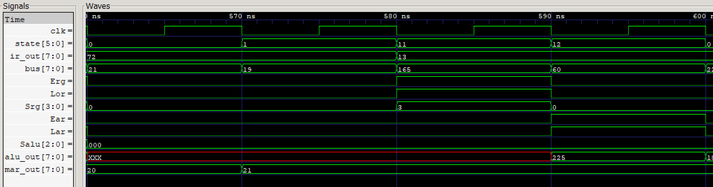
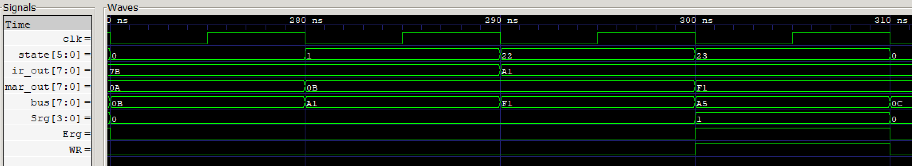

# Processor v1.0


An 8-bit accumulator-based processor implemented in Verilog, based on
*Design of a Simple Processor* by Prof. P.J. Narayanan, IIIT Hyderabad.

---

## Overview

This project is an implementation of the processor described in *Design of a Simple Processor* by Prof. P.J. Narayanan. The reference design presents a simple educational CPU to illustrate fundamental computer architecture concepts, including instruction execution, datapath design, control sequencing, and memory interfacing.

The processor follows a single-bus, accumulator-based architecture with an 8-bit datapath, 256-byte memory, and a hardwired finite state machine (FSM) control unit. This implementation supports the complete instruction set described in the reference up to Chapter 5, including data movement, arithmetic/logic, immediate, and memory access instructions.

## Architecture

Single-bus accumulator architecture with hardwired FSM control unit.

<p align="center">
  
</p>

## Implemented ISA
The following instruction categories are implemented in the current processor.

| Category | Instructions |
|----------|--------------|
| Data movement | MOVI, MOVS, MOVD |
| Register ALU | ADD, SUB, XOR, AND, OR, CMP |
| Immediate ALU | ADI, SBI, XRI, ANI, ORI, CMI |
| Memory | LOAD, STOR |
| Control | NOP, STOP |

## Components

| Component | Description |
|-----------|-------------|
| PC | 8-bit program counter, increment + load |
| AR | Accumulator — drives bus, loads from ALU output |
| OR | Operand register — right input to ALU, bidirectional bus |
| MAR | Memory address register |
| IR | Instruction register — holds current opcode |
| RegFile | R0–R11, 12 × 8-bit general purpose registers |
| ALU | ADD, SUB, AND, OR, XOR, PASS0, CMP |
| Control | Hardwired FSM, 26 states |

Full ISA → [docs/ISA.md](docs/ISA.md)

Microinstruction Control Table → [docs/control_table.md](docs/control_table.md)

---

## Project Structure

```
processorV1.0/
├── README.md
├── rtl/
│   ├── alu.v
│   ├── pc.v
│   ├── regs.v
│   ├── func_regs.v       ← AR, OR, IR, MAR
│   ├── memory.v
│   ├── control.v
│   ├── processor.v
|   └── alu_defs.vh
├── tb/
│   ├── alu_tb.v
│   ├── ar_tb.v
│   ├── control_tb.v
│   ├── or_tb.v
│   ├── pc_tb.v
│   ├── regs_tb.v
│   └── proc_tb.v
├── sim/
│   ├── ADDinstruction.gtkw
│   ├── STORinstruction.gtkw
│   └── .gitkeep
├── programs/
│   ├── test1.asm / test1.hex
│   ├── test2.asm / test2.hex
│   ├── test3.asm / test3.hex
│   ├── test4.asm / test4.hex
│   └── test5.asm / test5.hex
├── docs/
│   ├── Architecture.png
│   ├── ISA.md
│   ├── control_table.md
│   └── waveforms/
│       ├── alu_waveform.png
│       ├── FetchDecode.png
│       ├── ADDinstruction.png
│       └── STORinstruction.png
├── assembler.py
├── Makefile
└── .gitignore
```

---

## How to Run

**Requirements:**
```bash
sudo apt install iverilog gtkwave python3
```

**Compile:**
```bash
make proc
```

**Run tests:**
```bash
make test1    # assemble + simulate + print PASS/FAIL
make test2
make test3
make test4
make test5
```

**View waveforms:**
```bash
make wave           # open latest VCD
make wave_add       # ADD instruction execution
make wave_stor      # STOR instruction execution
```

**Write your own program:**
```bash
python assembler.py programs/mytest.asm
# outputs programs/mytest.hex
```

---

## Development

Individual component testbenches are available for unit testing:

```bash
make alu        # ALU operations
make regs       # register file
make pc         # program counter
make ar         # accumulator register
make or         # operand register
make control    # FSM control unit
```

## Assembler

Converts `.asm` files to `.hex` files for the simulator.

```bash
python assembler.py programs/mytest.asm
# outputs programs/mytest.hex
```

**Syntax:**
```asm
; comment
movi R0 5       ; decimal immediate
movi R1 0x0A    ; hex immediate
movs R0         ; AR = R0
add  R1         ; AR = AR + R1
movd R2         ; R2 = AR
stop
```

Supports all instructions from [docs/ISA.md](docs/ISA.md).

---

## Test Programs

| Test | What it verifies |
|------|-----------------|
| test1 | `MOVI` immediate instruction and register write. |
| test2 | `MOVI`, `MOVS`, `ADDI`, and `MOVD` data transfer through the accumulator and ALU. |
| test3 | Memory `STORE`/`LOAD`, register-to-register transfers, and ALU operations (`ADD`, `XOR`, `SBI`) in a multi-instruction program. |
| test4 | Comprehensive validation of all ALU and immediate instructions using varied operands and chained register operations. |
| test5 | End-to-end processor validation combining memory (`LOAD`/`STORE`), data movement, and ALU/immediate instructions in a complex execution sequence. |

All tests verified by checking final register state against
hand-traced expected values.

---

## Waveforms

### ALU


### Fetch Cycle
FETCH1: PC→MAR, PC++ — FETCH2: memory read→IR



### ADD Instruction
ALU3: register→OR — ADD4: AR+OR→ALU→AR



### STOR instruction
Execution of a memory write operation showing address placement in MAR,
register data driven onto the bus, and memory write enable assertion.



---

## Design Decisions

**Hardwired Control Unit:**
The book's Chapter 7 describes ROM-based microprogrammed control.
This implementation uses a hardwired FSM — simpler to build and
debug for a 12-instruction set. Each FSM state corresponds
directly to a row in [docs/control_table.md](docs/control_table.md).
V2.0 will migrate to a microprogrammed sequencer as the instruction set grows.

**Shared FSM states:**
Instructions with identical microcycle sequences share states —
IMM3/IMM4 for all immediate instructions, ALU3 for all register
ALU instructions, MEM3 for load/stor. Reduces total states from
~37 to 26.

**Custom Assembler and Runtime-Selectable Programs:**
The original processor design assumes machine code is provided directly. To streamline development and testing, a custom assembler was implemented to convert assembly programs into hexadecimal memory images. Additionally, instruction memory is initialized using Verilog plusargs (`+hexfile=...`), allowing different test programs to be loaded and executed without recompiling the processor. This improved code readability, reduced manual encoding errors, and enabled rapid testing of multiple programs.

---

## Implementation Summary

- 8-bit datapath
- 12 general-purpose registers
- 256-byte memory
- 19 implemented instructions
- 26 FSM control states
- Single shared bus
- Hardwired control unit

## Roadmap — v2.0

- [ ] Flag register (Z, C, S, P)
- [ ] Conditional jumps — `jmpd`, `jmpr`
- [ ] Call and return — `cd`, `cr`, `ret`
- [ ] Stack pointer + `push`, `pop`
- [ ] Microprogrammed ROM control unit
---

## Reference

P.J. Narayanan, *Design of a Simple Processor*, IIIT Hyderabad.